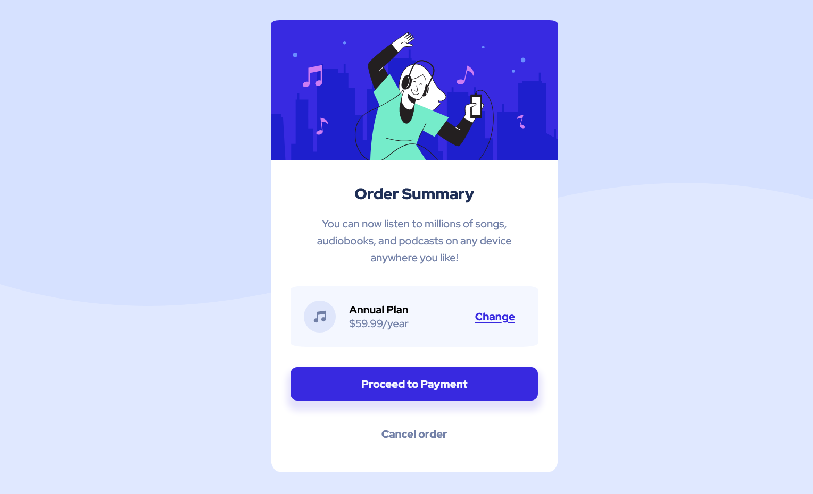

# Frontend Mentor - Order summary card solution

This is a solution to the [Order summary card challenge on Frontend Mentor](https://www.frontendmentor.io/challenges/order-summary-component-QlPmajDUj). Frontend Mentor challenges help you improve your coding skills by building realistic projects. 

## Table of contents

- [Screenshot](#screenshot)
- [Links](#links)
- [Built with](#built-with)
- [Author](#author)

### Screenshot

### Links

- Solution URL: https://www.frontendmentor.io/solutions/order-summary-component-44Oth-e7K
- Live Site URL: https://kiruanime2003.github.io/order-summary-component-main/

### Built with

- Semantic HTML5 markup
- CSS 
- Flexbox
- SCSS

## Author

- Website - [Kiruthiga K](https://kiruanime2003.gitlab.io)
- Frontend Mentor - [@kiruanime2003](https://www.frontendmentor.io/profile/kiruanime2003)
